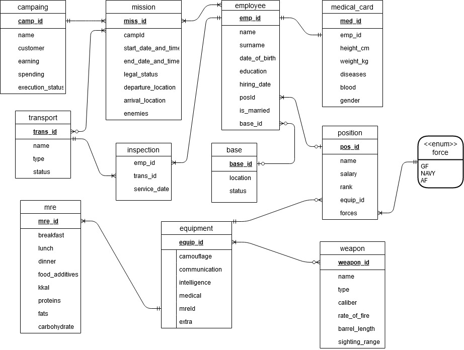
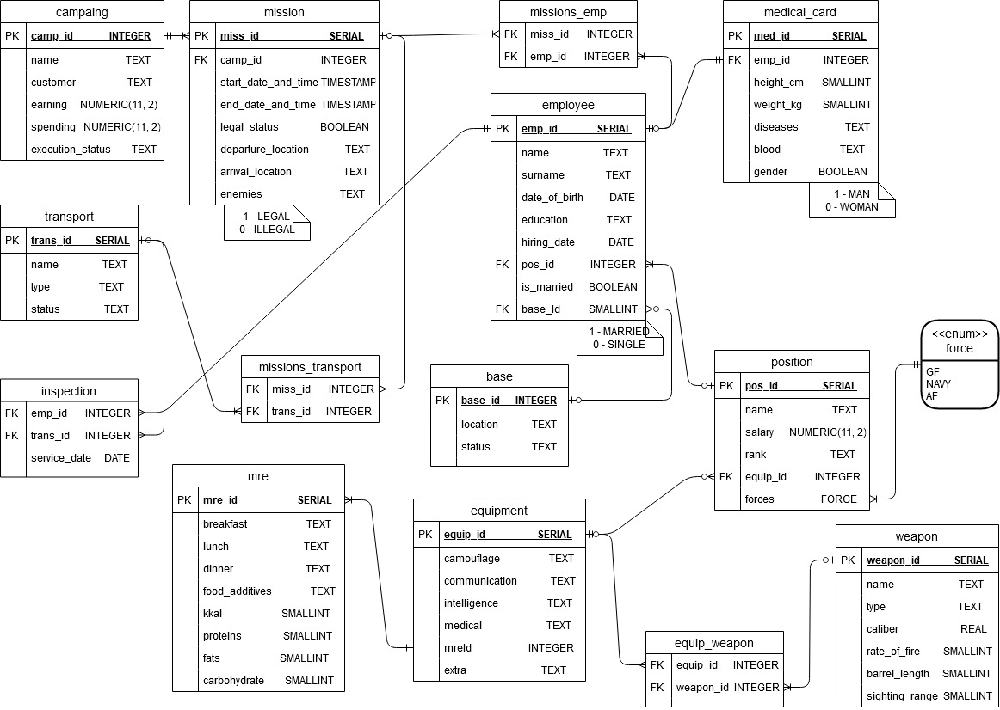
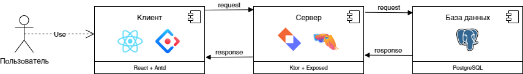

# Лабораторная работа №1
**Вариант 948**

Для выполнения лабораторной работы №1 необходимо:

1. На основе предложенной предметной области (текста) составить ее описание. Из полученного описания выделить сущности, их атрибуты и связи.
2. Составить инфологическую модель.
3. Составить даталогическую модель. При описании типов данных для атрибутов должны использоваться типы из СУБД PostgreSQL.
4. Реализовать даталогическую модель в PostgreSQL. При описании и реализации даталогической модели должны учитываться ограничения целостности, которые характерны для полученной предметной области.
5. Заполнить созданные таблицы тестовыми данными.

Для создания объектов базы данных у каждого студента есть своя схема. Название схемы соответствует имени пользователя в базе studs (sXXXXXX). Команда для подключения к базе studs:

```psql -h pg -d studs```

Предметная область:

    С полминуты Боумен и Пул молча изучали экран. Это изображение передавала на пульт управления длиннофокусная телевизионная камера, укрепленная на ободе большой параболической антенны. Перекрестье, наложенное центром на изображение Земли, указывало, что антенна ориентирована точно. Ведь если узкий карандашик луча не был бы наведен точно на Землю, они не смогли бы ни передавать, ни принимать передач. Сигналы, посланные в обоих направлениях, не попадали бы на антенны и улетали бы, унося с собой нераскрытыми слова и образы сквозь всю Солнечную систему в бескрайнюю пустоту, простирающуюся за ней. Если бы они и были когда-нибудь приняты, то лишь через столетия - и, конечно, не землянами...

# Лабораторная работа №2
**Вариант 9981**

П
о варианту, выданному преподавателем, составить и выполнить запросы к базе данных "Учебный процесс". Команда для подключения к базе данных ucheb:

```psql -h pg -d ucheb ```

1. Сделать запрос для получения атрибутов из указанных таблиц, применив фильтры по указанным условиям:

```
    Таблицы: Н_ЛЮДИ, Н_СЕССИЯ.
    Вывести атрибуты: Н_ЛЮДИ.ИМЯ, Н_СЕССИЯ.ДАТА.
    Фильтры (AND):
    a) Н_ЛЮДИ.ИМЯ > Александр.
    b) Н_СЕССИЯ.УЧГОД = 2001/2002.
    c) Н_СЕССИЯ.УЧГОД < 2008/2009.
    Вид соединения: INNER JOIN.
```

2. Сделать запрос для получения атрибутов из указанных таблиц, применив фильтры по указанным условиям:

```
    Таблицы: Н_ЛЮДИ, Н_ВЕДОМОСТИ, Н_СЕССИЯ.
    Вывести атрибуты: Н_ЛЮДИ.ИД, Н_ВЕДОМОСТИ.ЧЛВК_ИД, Н_СЕССИЯ.ИД.
    Фильтры (AND):
    a) Н_ЛЮДИ.ИМЯ < Николай.
    b) Н_ВЕДОМОСТИ.ЧЛВК_ИД = 153285.
    Вид соединения: RIGHT JOIN.
```

3. Вывести число студентов группы 3102, которые старше 25 лет. Ответ должен содержать только одно число.

4. Найти группы, в которых в 2011 году было ровно 10 обучающихся студентов на ФКТИУ. Для реализации использовать подзапрос.
5. Выведите таблицу со средними оценками студентов группы 4100 (Номер, ФИО, Ср_оценка), у которых средняя оценка больше минимальной оценк(е|и) в группе 3100.
6. Получить список студентов, зачисленных до первого сентября 2012 года на первый курс очной формы обучения (специальность: Программная инженерия). В результат включить:
    номер группы;
    номер, фамилию, имя и отчество студента;
    номер и состояние пункта приказа;
    Для реализации использовать соединение таблиц.
7. Сформировать запрос для получения числа в группе No 3100 отличников.

# Лабораторная работа №3
**Вариант 1754**

Составить запросы на языке SQL (пункты 1-2).

Для каждого запроса предложить индексы, добавление которых уменьшит время выполнения запроса (указать таблицы/атрибуты, для которых нужно добавить индексы, написать тип индекса; объяснить, почему добавление индекса будет полезным для данного запроса).

Для запросов 1-2 необходимо составить возможные планы выполнения запросов. Планы составляются на основании предположения, что в таблицах отсутствуют индексы. Из составленных планов необходимо выбрать оптимальный и объяснить свой выбор.
Изменятся ли планы при добавлении индекса и как?

Для запросов 1-2 необходимо добавить в отчет вывод команды EXPLAIN ANALYZE [запрос]

Подробные ответы на все вышеперечисленные вопросы должны присутствовать в отчете (планы выполнения запросов должны быть нарисованы, ответы на вопросы - представлены в текстовом виде).

1. Сделать запрос для получения атрибутов из указанных таблиц, применив фильтры по указанным условиям:
```
Н_ТИПЫ_ВЕДОМОСТЕЙ, Н_ВЕДОМОСТИ.
Вывести атрибуты: Н_ТИПЫ_ВЕДОМОСТЕЙ.НАИМЕНОВАНИЕ, Н_ВЕДОМОСТИ.ЧЛВК_ИД.
Фильтры (AND):
a) Н_ТИПЫ_ВЕДОМОСТЕЙ.НАИМЕНОВАНИЕ < Перезачет.
b) Н_ВЕДОМОСТИ.ИД < 1250972.
Вид соединения: LEFT JOIN.
```
2. Сделать запрос для получения атрибутов из указанных таблиц, применив фильтры по указанным условиям:
```
Таблицы: Н_ЛЮДИ, Н_ВЕДОМОСТИ, Н_СЕССИЯ.
Вывести атрибуты: Н_ЛЮДИ.ИМЯ, Н_ВЕДОМОСТИ.ДАТА, Н_СЕССИЯ.ИД.
Фильтры (AND):
a) Н_ЛЮДИ.ФАМИЛИЯ = Афанасьев.
b) Н_ВЕДОМОСТИ.ЧЛВК_ИД = 142390.
c) Н_СЕССИЯ.УЧГОД = 2001/2002.
Вид соединения: LEFT JOIN.
```

# Курсовая работа
### База данных для частной военной компании**

Частная военная компания имеет штаб `СОТРУДНИКОВ` (у работников необходимо узнать `ИМЯ, ФАМИЛИЮ, ДАТУ_РОЖДЕНИЯ, ОБРАЗОВАНИЕ` и текущий `СЕМЕЙНЫЙ_СТАТУС`, а также хранить его `ДАТУ_ЗАЧИСЛЕНИЯ` на службу), которые могут занимать различные военные и невоенные `ДОЛЖНОСТИ (НАЗВАНИЕ_ДОЛЖНОСТИ, ЗАРПЛАТУ ВОИНСКОЕ_ЗВАНИЕ` если есть, номер комплекта `ЭКИПИРОВКИ`, и тип `ВООРУЖЕННЫХ_СИЛ` (также работники могут занимать гражданские должности)). 
Типы `ВС: СВ, ВМФ, ВКС`.
Каждый сотрудник имеет `МЕДКАРТУ` (с информацией о `РОСТЕ` в см, `ВЕСЕ` в кг, `ГРУППЕ_КРОВИ` (по системе AB0), `ПЕРЕНЕСЁННЫХ_ТРАВМАХ/ЗАБОЛЕВАНИЯХ, БИОЛОГИЧЕСКОМ_ПОЛЕ`) и закрепленную за ним `БАЗУ`, являющуюся его основным местом прибывания (с информацией о `МЕСТОПОЛОЖЕНИИ` базы и её  `СТАТУСЕ`). 
Сотрудники могут отправляться на `МИССИИ` (нужно хранить `НАЗВАНИЕ, ДАТУ_И_ВРЕМЯ_СТАРТА` и `ЗАВЕРШЕНИЯ, ЮРИДИЧЕСКИЙ_СТАТУС, МЕСТО_ОТПРАВЛЕНИЯ` и `ПРИБЫТИЯ, ВРАГОВ`), а также историю миссий сотрудников. 
Миссия является большой частью военной `КАМПАНИИ` (должно содержать `НАЗВАНИЕ, ЗАКАЗЧИКА, ПРИБЫЛЬ, ЗАТРАТЫ` и `СТАТУС_ВЫПОЛЕНИЯ`) на `ТРАНСПОРТЕ` (`НАЗВАНИЕ, ТИП`, необходимо также знать, когда `СОСТОЯНИЕ` находится), принадлежащем чвк (транспорт, естественно не утилизируется после миссии и может быть использован повторно).  
Для безопасности, стоит хранить историю всех `ТЕХОСМОТРОВ` (с номерами `ТРАНСПОРТА, ОБСЛУЖИВАЮЩЕГО, ДАТЫ_ОСМОТРА`).
Людям с военной должностью должен выдаваться комплект `ЭКИПИРОВКИ` (где может быть (но необязательно) `КАМУФЛЯЖ, СРЕДСТВА_КОММУНИКАЦИИ, РАЗВЕДКИ, МЕДИКАМЕНТЫ` и `ПРОЧЕЕ`). 
Экипировка в обязательном порядке должна включать один из `ИРП` (с описание о `БЕЛКАХ, ЖИРАХ, УГЛЕВОДАХ` и `КАЛОРИЙНОСТИ`, блюдах `ЗАВТРАКА, ОБЕДА, УЖИНА, ПИЩЕВЫХ_ДОБАВКАХ`). 
Экипировка может содержать одно или несколько `ОРУЖИЙ` (с подробными техническими характеристиками, будь то `НАЗВАНИЕ, ТИП, КАЛИБР, СКОРОСТРЕЛЬНОСТЬ, ДЛИНА_СТВОЛА, ПРИЦЕЛЬНАЯ_ДАЛЬНОСТЬ`).
Процессы
1.	Тех, кто не имеет воинских званий, нельзя отправлять на боевые миссии.
2.	Информационная система должна учитывая какие сотрудники отправились на миссии (один и тот же сотрудник не может находиться на двух миссиях одновременно).
3.	Работников неподходящих по физическим данным запрещено устраивать как военных сотрудников.
4.	Необходимо хранить историю инспекций транспорта, а транспорт со статусами «сломан» или «в ремонте» нельзя использовать в операциях.
5.	Если за базой не закреплён ни один сотрудник, стоит закрыть её.
6.	Стараться отправлять на боевые операции при прочих равных в первую очередь неженатых военных, давно не участвовавших в миссиях, имеющих большой опыт работы. 

***Инфологическая модель***


***Даталогическая модель***


***Компонентная модель**
